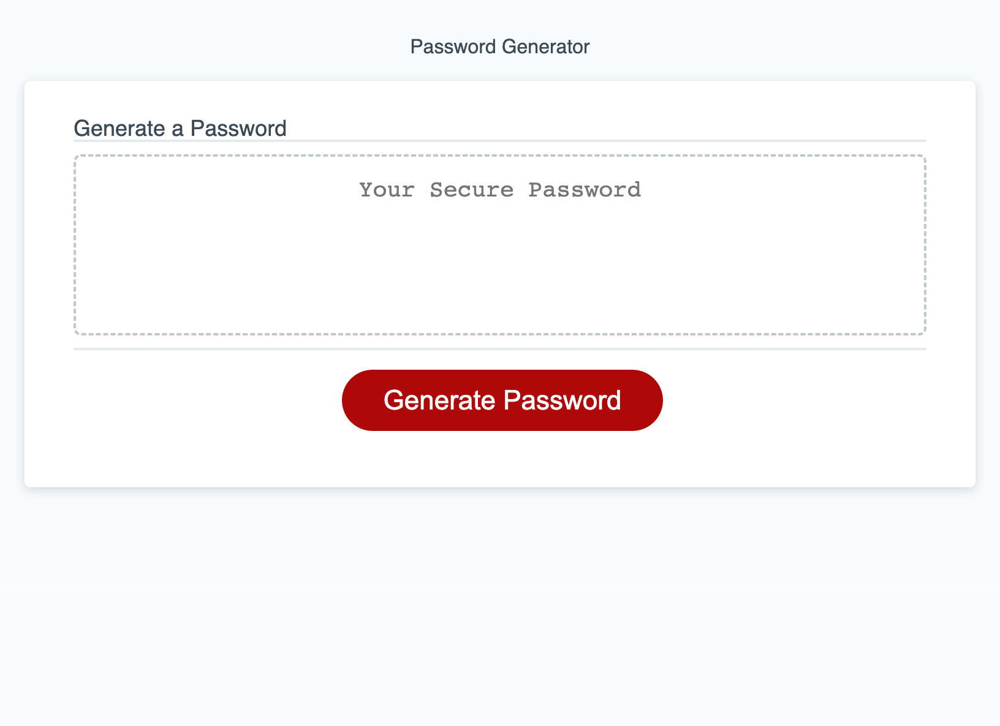

# Description 

In this project, we created an application that would randomly generate a secure password for a user, when creating new online accounts across many different websites. Since many users have a bad habit of re-using passwords across different accounts, this password generator looks to solve that issue. 

 

## Instructions

To generate a secure password, simply click on the "Generate Password" button and you will be prompted to go through a series of Window prompts. The first prompt being, is to specify how many characters the user would like to use that is at least 8 characters , and no more than 128 characters long. The rest of the prompts will ask the user what password criteria they would prefer to be included in their password, for example Uppercase, Lowercase, Numbers, & symbols. 

 

## Screenshot of deployed application:
 

 

## Video Demonstration: 

https://user-images.githubusercontent.com/76631936/209562527-c65c7cf0-4e43-4b5c-bbf8-377a132f1864.mp4

